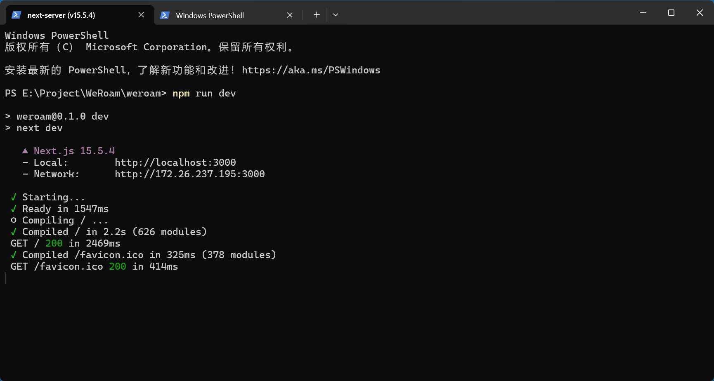

## 项目背景

北京邮电大学2024级信息工程 - 程序设计实验 - 课程大作业

云旅札记 ( WeRoam ) —— AI 驱动的智能旅行规划助手

## 环境和框架

Node.js : v22.18.0 -- npm : 11.5.2

Next.js : 15.5.4

## 合作开发规范

### 环境准备

1. [Releases · coreybutler/nvm-windows](https://github.com/coreybutler/nvm-windows/releases)
   里面下载最新版的nvm-setup.exe并安装
   版本为1.2.2

2. cmd里输入`nvm install 22`
   安装node.js 22.18.0（会同步安装npm11.5.2）

3. 安装git
   [Git是什么 - Git教程 - 廖雪峰的官方网站](https://liaoxuefeng.com/books/git/what-is-git/index.html)

4. 在 https://github.com/SturgeonYang/WeRoam 里面点击右上角的fork，把仓库镜像到你的账户上（私有或者公开都行）

5. 在本地挑选一个文件夹（无中文路径），右键打开 git bash 终端

6. 按照 https://blog.csdn.net/weixin_42310154/article/details/118340458 的教程配置 ssh 密钥

7. 在终端进入步骤5挑选的文件夹后，`git remote add origin git@github.com:你的GithubID/WeRoam.git`

8. `git branch -m master main`将本地默认的 master 分支名改成 main

9. 运行 `git clone` 命令，克隆远程仓库到本地。

    ```
    git clone git@github.com:你的GithubID/WeRoam.git

10. 进入本地仓库对应的文件夹，在当前路径右键打开 git bash 或者 cmd
11. 先输入 npm install，部署一下
12. 输入 npm run dev，若显示如图，就成功了，点开里面的网址即可访问


### 协作开发规范

**规则：不能直接向 `main` 分支推送（push）代码** 
所有的代码变更都必须通过 **Pull Request (PR)** 的方式进行。

下面是**每一次**开发新功能或修复 Bug 的标准流程：

1. 第一步：同步最新代码
   
    在开始写任何新代码之前，永远先确保你的本地 main 分支是最新版本。
    
    ```Bash
    # 切换到 main 分支
    git checkout main
    
    # 从远程仓库拉取最新的 main 分支代码
    git pull origin main
    ```
    
2. 第二步：创建自己的开发分支 (Feature Branch)
   
    为你要做的新功能创建一个新的分支。分支命名要有意义，例如：
    
    Bash
    
    ```
    # -b 参数表示创建并立即切换到这个新分支
    # 示例1: 开发“关于我们”页面
    git checkout -b feature/about-us-page
    
    # 示例2: 修复导航栏的 bug
    git checkout -b fix/navbar-style
    ```
    
3. 第三步：在新分支上进行开发
   
    现在你可以在这个独立的分支上安心写代码了，不会影响到主分支和其他人。
    
    - 比如，创建新的页面、组件，修改样式等。
      
    - 你可以随时进行提交（commit）来保存你的进度。
      
        Bash
        
        ```
        # 添加你想保存的文件
        git add .  # "." 代表所有修改过的文件
        
        # 提交你的更改，并写清楚本次提交做了什么
        git commit -m "Feat: Create basic structure for About Us page"
        ```
    
4. 第四步：将自己的分支推送到远程仓库
   
    当你觉得这个功能开发完成，或者需要其他人看到你的代码时，就把它推送到 GitHub。
    
    ```Bash
    # 'origin' 是你的远程仓库，后面是你的分支名
    git push origin feature/about-us-page
    ```
    
5. 第五步：创建 Pull Request (PR)
   
    推送成功后，打开你们的 GitHub 仓库页面，通常会看到一个黄色的提示条，让你为你刚刚推送的分支创建一个 Pull Request。
    
    - 点击 `Compare & pull request` 按钮。
      
    - 写清楚这个 PR 的标题和描述，说明你完成了什么功能，解决了什么问题。
      
    - 在右侧的 `Reviewers` 里，选择一到两位团队成员来审查你的代码。
      
    - 点击 `Create pull request`。
    
    

### 项目结构概览 (`src` 目录)

- `src/app/page.tsx`: 这是你的网站首页。
- `src/app/layout.tsx`: 这是全局布局文件，所有页面都会应用这个布局。可以在这里放页头（Header）、页脚（Footer）。
- `src/app/globals.css`: 全局 CSS 文件，用于统一样式，比如字体、颜色等等。
- 其他部分想到什么都能用AI生成（，不用手搓
